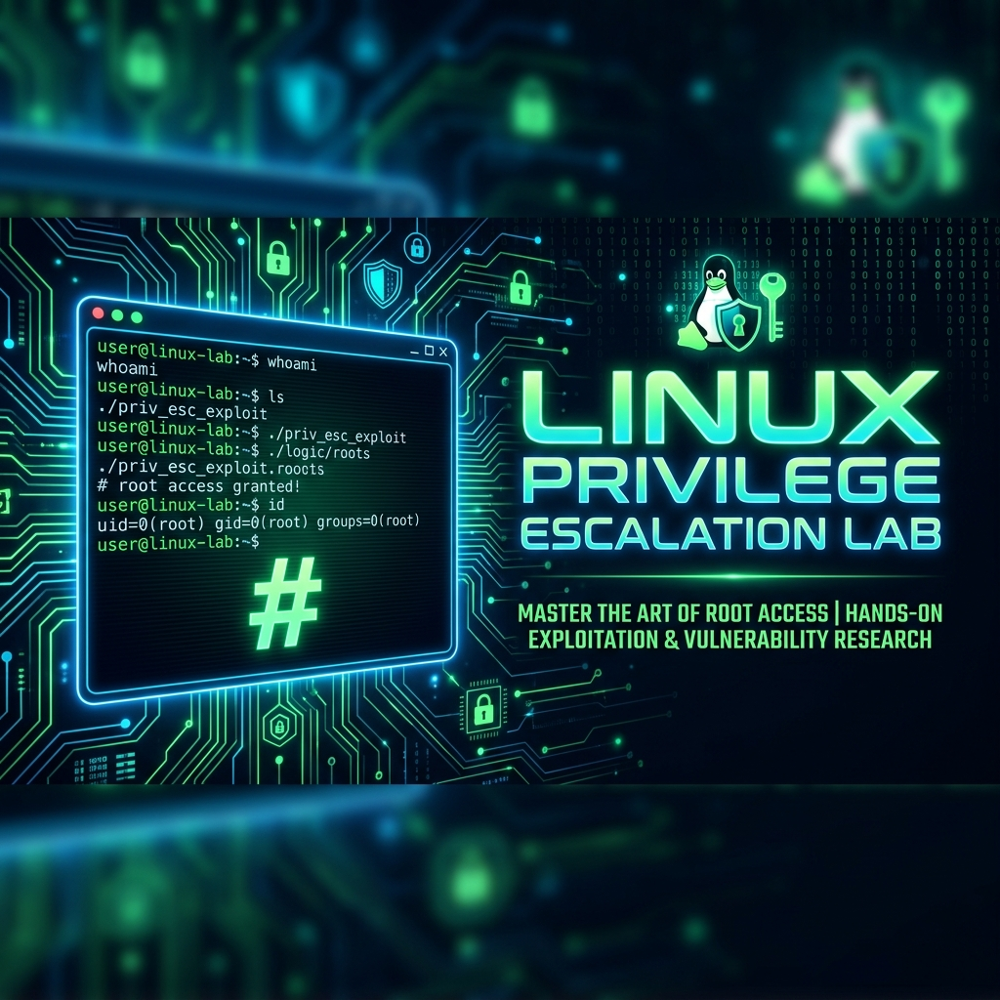
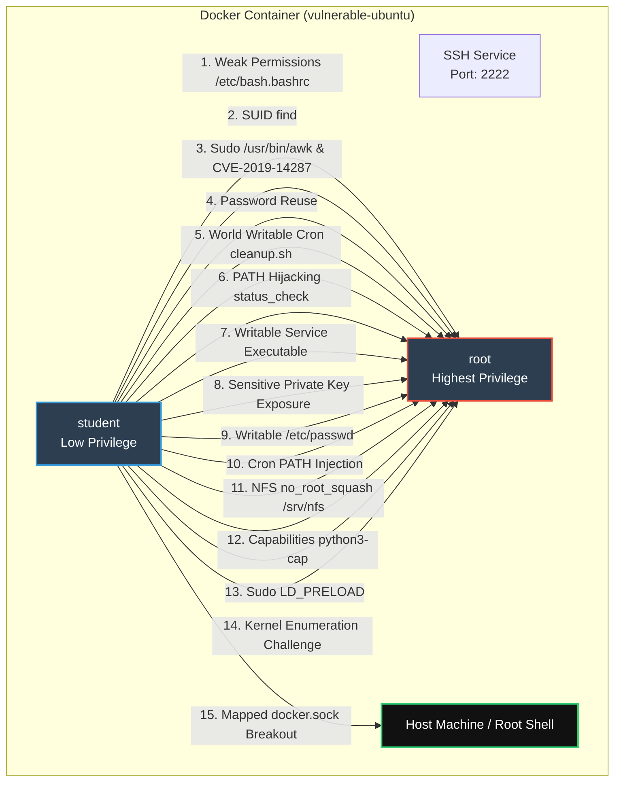

<div align="center">
  

  # Linux-Priv — Linux Privilege Escalation Laboratory

  **A complete, self-contained Linux Privilege Escalation attack lab running purely in Docker.**<br>
  *A comprehensive training platform showcasing 15 different local privilege escalation vectors including weak permissions, SUID binaries, misconfigured sudo rules, capabilities, and docker breakouts.*

  [](https://www.docker.com/)
  [](#prerequisites)
  [](#attack-scenarios)
  [](LICENSE)
</div>

---

## ⚠️ Security Warning
> [!CAUTION]
> **This lab is EXTREMELY VULNERABLE by design.**
> - Never expose it to the internet
> - Use only on isolated/private networks
> - Do not run arbitrary commands on the host using the mapped Docker socket
> - Destroy completely when not in use

---

## 🏗️ Lab Architecture


---

## 🛠️ Prerequisites
| Requirement | Minimum |
|---|---|
| **Docker Engine** | ≥ 24.0 |
| **Docker Compose** | ≥ 2.20 |
| **RAM** | 2 GB free space |
| **Disk** | 5 GB free space |
| **OS** | Linux, macOS, or Windows (WSL2 / Docker Desktop) |

---

## 🚀 Deployment

### 🐧 Linux/macOS users:
```bash
# 1. Clone the project
git clone <your-repository-url> Linux-Priv
cd Linux-Priv

# 2. Deploy (automated)
docker compose up -d --build
```

### 🪟 Windows users (WSL2 / PowerShell):
```powershell
# Deploy the stack
docker-compose up -d --build
```

---

## 🌐 Connection & Credentials
| Target User | Connection Method | Password | Initial Access |
|---|---|---|---|
| **student** | `ssh student@localhost -p 2222` | `student123` | Low-privileged Access |
| **student** | `docker exec -it linux-priv-esc-lab su - student` | *N/A* | Interactive Terminal |

---

## ⚔️ Attack Scenarios
This lab features 15 privilege escalation vectors categorised into 3 tiers of difficulty. Your objective is to capture the flags `/root/flag1.txt` through `/root/flag15.txt`.

---

## 📋 Student TODO — Progress Tracker
> [!NOTE]
> Work through these challenges. Tier 1 lists easy vectors, Tier 2 lists medium, and Tier 3 lists advanced/breakout vectors. Check off tasks as you complete them!

### 🟢 Tier 1 — Easy Exploitations
> Basic configuration and standard Linux misconfigurations.

- [ ] **[Flag 1] Weak File Permissions**: Append a payload (e.g. `chmod u+s /bin/bash`) to `/etc/bash.bashrc` and capture `/root/flag1.txt`.
- [ ] **[Flag 2] SUID Binary Abuse**: Use the SUID bit on `/usr/bin/find` to execute commands as root and retrieve `/root/flag2.txt`.
- [ ] **[Flag 3] Misconfigured sudo Rights**: Escalate to root via Sudoers rules using `/usr/bin/awk` or negative UID wrapper and capture `/root/flag3.txt`.
- [ ] **[Flag 4] Password Reuse**: Switch to the root account using the low-privileged user's password and capture `/root/flag4.txt`.
- [ ] **[Flag 5] World Writable Cron Jobs**: Overwrite `/usr/local/bin/cleanup.sh` and wait for the root cron job to run it, capturing `/root/flag5.txt`.

---

### 🟡 Tier 2 — Medium Escalations
> Involves environment manipulation, service abuse, and capability exploitation.

- [ ] **[Flag 6] PATH Hijacking**: Abuse the `/usr/local/bin/status_check` SUID binary by hijacking its un-pathed `service` command, capturing `/root/flag6.txt`.
- [ ] **[Flag 7] Writable Service Executables**: Overwrite the backend binary `/usr/local/bin/custom-daemon` and restart the service via sudo to obtain `/root/flag7.txt`.
- [ ] **[Flag 8] Sensitive Files Exposure**: Find the exposed root private SSH key inside `/var/backups/root_ssh.bak` and SSH to localhost, capturing `/root/flag8.txt`.
- [ ] **[Flag 9] Writable /etc/passwd**: Inject a custom user with GID/UID 0 into the world-writable `/etc/passwd` file and retrieve `/root/flag9.txt`.
- [ ] **[Flag 10] Cron PATH Injection**: Exploit the custom PATH defined at the top of `/etc/crontab` to hijack `cron_cleanup`, capturing `/root/flag10.txt`.

---

### 🔴 Tier 3 — Domination & Breakouts
> Advanced capabilities, NFS exports, shared object injection, and docker container breakouts.

- [ ] **[Flag 11] NFS Misconfiguration**: Create a compiled C payload named `nfs_exploit` in the world-writable `/srv/nfs` export, trigger SUID conversion via simulator, and capture `/root/flag11.txt`.
- [ ] **[Flag 12] Capabilities Abuse**: Locate the binary with `cap_setuid` capability (`/usr/bin/python3-cap`) and run a Python script to set UID to 0, capturing `/root/flag12.txt`.
- [ ] **[Flag 13] Environment Variable Abuse**: Abuse the `LD_PRELOAD` environment variable preservation in `sudoers` to load a custom shared library as root, capturing `/root/flag13.txt`.
- [ ] **[Flag 14] Kernel Version Enumeration**: Query system/kernel details to identify the famous 2021 OverlayFS privilege escalation CVE, input it in `/usr/local/bin/kernel_challenge`, and capture `/root/flag14.txt`.
- [ ] **[Flag 15] Docker Breakout**: Exploit membership in the `docker` host socket group to mount the host filesystem and retrieve `/root/flag15.txt`.

---

## 📊 Scoring
| Tier | Tasks | Points Each | Max Points |
|---|---|---|---|
| 🟢 Tier 1 — Easy | 5 tasks | 10 pts | 50 pts |
| 🟡 Tier 2 — Medium | 5 tasks | 20 pts | 100 pts |
| 🔴 Tier 3 — Domination | 5 tasks | 30 pts | 150 pts |
| **Total** | **15 vectors** | | **300 pts** |

---

## 🧹 Cleanup
To stop and remove the laboratory environment:
```bash
docker compose down
```

---

## 📜 Directory Structure
```text
linux-priv-esc-lab/
├── docs/images/             # Repository banner and assets
├── entrypoint.sh            # Container boot and Docker GID alignment script
├── status_check.c           # PATH hijacking C payload source
├── kernel_challenge.c       # Kernel challenge interactive SUID source
├── systemctl_mock.sh        # Wrapper mimicking systemd restart utility
├── Dockerfile               # Complete laboratory environment build configuration
├── docker-compose.yml       # Docker compose orchestration deployment
└── README.md                # Student guide and documentation
```

<br>
<div align="center">
  <i>Created for educational and authorized penetration testing training only.</i>
</div>
